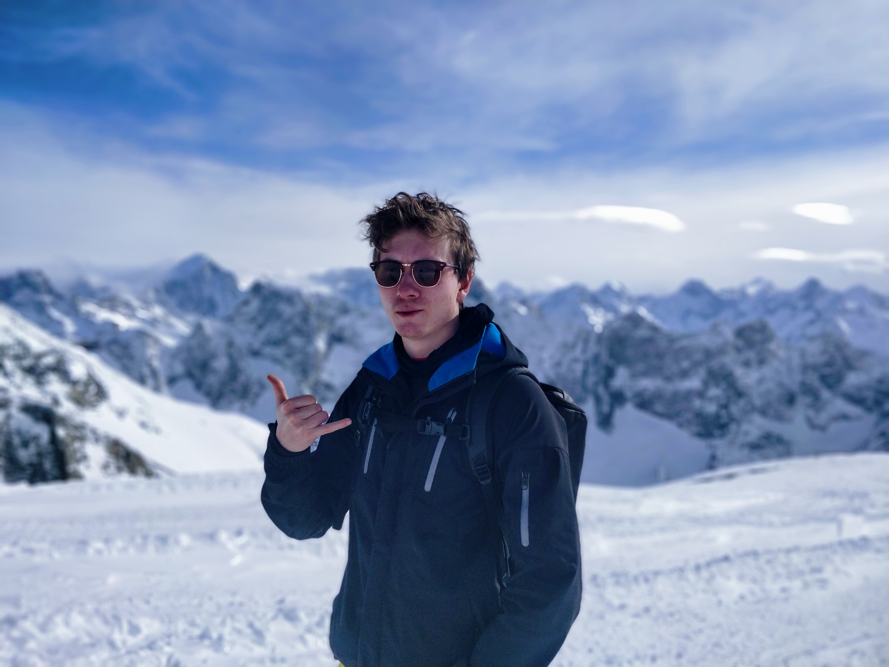

# Hi 👋, my name is Wouter

## Current projects

### Quadrotor motion planning

### LIDAR sensor fusion for intelligent vehicles

## Previous projects

### Machine learning for pen pose estimation
Train classical and Deep Learning methods for the purpose of picking up cutlery with a small robot.

Worked together on this project with Wesley who made a post about our succes:

<iframe src="https://www.linkedin.com/embed/feed/update/urn:li:share:6737753292039872512" height="600" width="804" frameborder="0" allowfullscreen="" title="Embedded post"></iframe>

### Meta learning deep learning reproduction project

We wrote a blogpost detailing our reproduction efforts.

https://h0uter.github.io/MLDG/

### Stabilizing a double pendulum 
 Learned to apply several different control strategies to stabilize a double  pendulum in various positions on a physical setup.

<iframe width="560" height="600" src="https://www.youtube.com/embed/qcokfeDFilA" frameborder="0" allow="accelerometer; autoplay; clipboard-write; encrypted-media; gyroscope; picture-in-picture" allowfullscreen></iframe>

(credits: not my video, but same setup)

### pcl and OpenCV Intelligent vehicle implementation in ROS
Using pcl I implemented plane segmentation and pedestrian detection using LIDAR sensor as input. My partner used OpenCV to detect the road boundaries and keep the car on the road.

