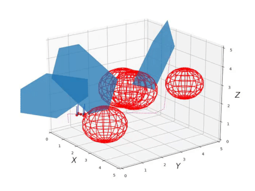

# Hi 👋, my name is Wouter

Hi thanks for visiting! This is currently a work in progress. Below I've listed some of my projects

## Current projects 

---

### Quadrotor motion planning

We implemented several path planning algorithms to steer a drone through an obstacle course. I mainly worked on the drone controller.

[PDM Project](https://github.com/h0uter/PDM-project)

 
 

### Perception for intelligent vehicles

Currently working on LIDAR and stereo camera data fusion. Before that I worked on implementing a Kalman filter to track and predict the movements of pedestrians. Additionally we work on using a particle filter to localize a robot in a known map.

 
 

## Previous projects 

---

### Machine learning for pose estimation
Train classical and Deep Learning methods for the purpose of picking up cutlery with a small robot.

Worked together on this project with Wesley who made a post about our success:

<iframe src="https://www.linkedin.com/embed/feed/update/urn:li:share:6737753292039872512" height="600" width="804" frameborder="0" allowfullscreen="" title="Embedded post"></iframe>

 
 

### Meta learning deep learning reproduction project

> Humans are adept at solving tasks under many different conditions. This is partly due to fast adaptation, but also due to a lifetime of encountering new task conditions. This provides the opportunity to develop strategies, which are robust to different task contexts.
>
> We would like artificial learning agents to do the same because this would make them much more versatile and perform better ‘out-the-box’

We wrote a blogpost detailing our reproduction efforts.

[https://h0uter.github.io/MLDG/](https://h0uter.github.io/MLDG/)

 
 

### Stabilizing a double pendulum 

 Learned to apply several different control strategies to stabilize a double  pendulum in various positions on a physical setup.

<iframe width="560" height="400" src="https://www.youtube.com/embed/qcokfeDFilA" frameborder="0" allow="accelerometer; autoplay; clipboard-write; encrypted-media; gyroscope; picture-in-picture" allowfullscreen></iframe>

(credits: not my video, but same setup)

 
 

### pcl and OpenCV implementation in ROS

The goal was to make an intelligent vehicle complete an obstacle course. Using pcl I implemented plane segmentation and pedestrian detection using LIDAR sensor as input. My partner used OpenCV to detect the road boundaries and keep the car on the road.

